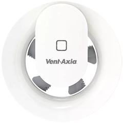

# Vent-Axia Svara

Unofficial Home Assistant integration for the Vent-Axia Svara lineup over BLE.

## Scope

This repository contains an unofficial Home Assistant integration built specifically to support the Vent-Axia Svara lineup. It uses local BLE control with `MAC + PIN` and supports multiple fans under one integration entry.

## Version

Current release: `v1.0.0`

## Features

- manual setup with `MAC + PIN`
- multiple devices under one integration entry
- BLE read and write support for the exposed Svara controls
- global configuration options for clock sync and scan intervals
- diagnostic entities for protocol state, clock, alias, and status
- fan and configuration controls with updated names and ordering

## Supported Models

- Confirmed support: `Vent-Axia Svara`
- Not implemented in this integration: `Vent-Axia Svensa` / `PureAir Sense`
- No other fan models are explicitly supported by this repository
- Even where other products may be related to the same upstream family, they should be treated as unsupported unless this integration adds explicit model handling for them

## Installation

### Manual Install

1. Copy [`custom_components/svara_vent_axia_ble`](/Users/danielfanica/Work/vent-axia-homeassistant-project/vent-axia-svara-ble/custom_components/svara_vent_axia_ble) into your Home Assistant `custom_components` directory.
2. Restart Home Assistant.
3. Go to `Settings -> Devices & Services -> Add Integration`.
4. Search for `Vent-Axia Svara`.

### HACS

`hacs.json` is included in this repo, but the repository metadata is still project-local and should be treated as work in progress until the repo is published in its final location.

If you use HACS before publication is finalized, add the repository manually and verify that the downloaded integration folder is `svara_vent_axia_ble`.

## Setup

When adding a fan, the integration currently expects:

1. A device name of your choice.
2. The fan MAC address.
3. The PIN printed on the fan sticker.

After setup, verify that entities appear and that the fan clock is correct.

## Important Behavior

- If the fan is configured through the official app as well, this integration can lose control and all entities may become unavailable.
- This integration is intended to be the BLE owner for the fan.

## Bluetooth Notes

- Home Assistant needs working Bluetooth coverage near the fan.
- If Home Assistant does not have onboard Bluetooth, use a supported Bluetooth proxy.
- BLE reliability still depends on signal quality and adapter stability.

## Branding Note

- Source branding assets for the repository live in [`assets`](/Users/danielfanica/Work/vent-axia-svara-ble/assets).
- Home Assistant integration branding is provided by local files in [`custom_components/svara_vent_axia_ble/brand`](/Users/danielfanica/Work/vent-axia-svara-ble/custom_components/svara_vent_axia_ble/brand).
- The integration currently ships:
  - [`icon.png`](/Users/danielfanica/Work/vent-axia-svara-ble/custom_components/svara_vent_axia_ble/brand/icon.png)
  - [`logo.png`](/Users/danielfanica/Work/vent-axia-svara-ble/custom_components/svara_vent_axia_ble/brand/logo.png)

## Layout

- `custom_components/svara_vent_axia_ble`: Home Assistant integration
- `assets`: repo branding assets
- `CHANGELOG.md`: release history
- `LICENSE`: upstream license carried from the extracted base
